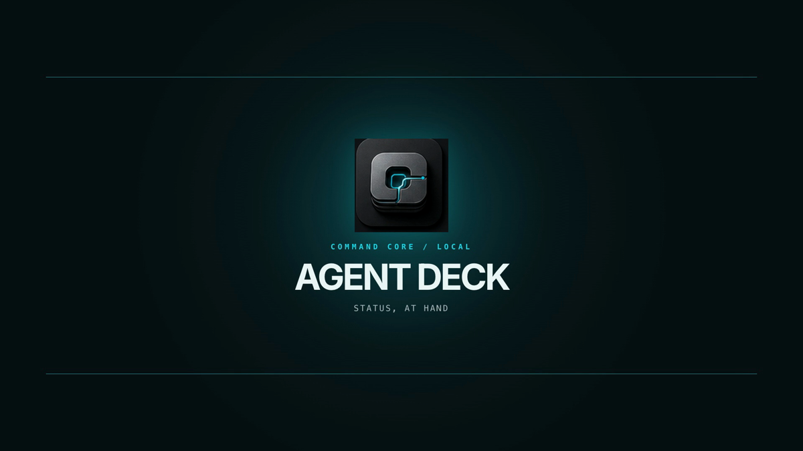
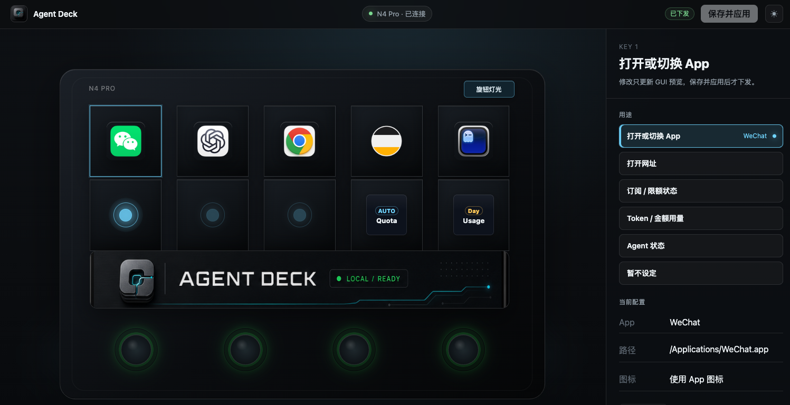

# Agent Deck

**[English](README.en.md)**

> 把本机 AI Agent 的运行状态、订阅额度与可控操作，带到妙联宝 N4 Pro 的硬件表面。

Agent Deck 是一个运行在本机的 AI Agent 硬件控制台桥接项目。它将 Agent 的状态、用量和经过明确配置的操作映射到妙联宝设备，并提供浏览器中的本地配置界面。当前版本 **`0.1.0`** 支持 **macOS + MiraBox N4 Pro + Codex**；其他操作系统、硬件型号与 Agent 平台暂不作兼容性承诺。

## 产品演示

[](https://breakstring.github.io/agent-deck/)

点击上图，在浏览器中观看 Agent Deck 的产品介绍视频。

## 它解决什么问题

当多个 AI Agent 同时运行时，状态、等待输入和用量信息容易散落在终端、桌面 App 和不同窗口中。Agent Deck 将这些本机信号归约为统一状态，并投影到有按键、触屏和旋钮的硬件表面：你可以一眼查看状态，切换面板或聚焦上下文，同时保持高风险动作默认关闭。

项目的核心边界始终保持为：

```text
Agent ingress -> NormalizedEvent -> AgentStateStore -> DeckMode/LayoutPlan
             -> HardwareSurface -> InteractionIntent/ActionExecutor
```

当前已验证的组合是 Codex 与 N4 Pro；核心架构仍为其他 Agent 与硬件保留扩展空间。

## Web 配置界面



本地配置页以 N4 Pro 预览为操作入口。选择按键或旋钮后，修改会先反映在 GUI 预览中；只有点击“保存并应用”才会下发到已连接的设备。可以配置：

- 10 个 LCD 主按键的本地 App、网址、订阅/额度、Token/金额用量与 Agent 状态入口。
- 底部逻辑面板的品牌图、Codex quota 和用量趋势；其中用量趋势来自本地缓存，切换时不阻塞硬件交互。
- 4 个旋钮的轮转动作，例如切换面板或周期、调整系统输入/输出音量、显示器亮度与控制台屏幕亮度。
- 旋钮灯圈组的颜色与可选呼吸效果，并在保存前预览。

未连接真实设备时，配置页和核心服务仍可通过 fake hardware 运行，便于体验、开发和排障。

## 当前支持范围

| 维度 | 当前状态 |
| --- | --- |
| 项目版本 | `0.1.0` |
| 操作系统 | macOS 为已验证目标。Windows 和 Linux 暂未正式支持。 |
| 真实硬件 | MiraBox N4 Pro。架构为其他 StreamDock/MiraBox 型号留有扩展空间，但尚未作为可用目标发布。 |
| Agent | Codex 本地 App/CLI 的状态、quota 与 hook 集成。 |
| Python | Python 3.11 或更高版本。 |
| 用量趋势 | 可选依赖 Bun 的 `bunx` 与 `ccusage`；缺失时，其他功能可继续运行，但 Token/金额趋势不可用。 |

## 快速开始

完整安装、硬件接管与排障说明请阅读[使用指南](docs/guides/using-agent-deck.zh-CN.md)。下面是以 fake hardware 启动本地配置页的最短路径：

```bash
git clone https://github.com/breakstring/agent-deck.git
cd agent-deck
uv sync --all-groups

# 读取本机环境与设备线索；该命令不会写屏或接管设备。
uv run agent-deckctl doctor

# 不接管真实硬件地启动本地服务。
scripts/agent-deckd-tmux.sh start --disable-hardware-renderer
```

然后打开 [http://127.0.0.1:8765/](http://127.0.0.1:8765/)。停止服务：

```bash
scripts/agent-deckd-tmux.sh stop
```

若要接管 N4 Pro，请先退出官方 MiraBox/StreamDock 应用，并在启动前通过 `doctor` 检查设备线索。macOS 上 SDK 动态库不兼容时，需要将 `AGENT_DECK_STREAMDOCK_SDK_PATH` 指向官方 Python SDK；具体做法见[真实硬件运行](docs/guides/using-agent-deck.zh-CN.md#真实硬件运行)。

## Codex 集成与安全边界

Agent Deck 可读取 Codex 的本地状态、quota 和 `ccusage` 数据，并可选安装 Codex hook 集成。安装器始终先输出 dry-run，只有显式传入 `--apply` 才会写入本机 Codex 配置：

```bash
# 检查当前 Codex 环境，并生成接入建议。
uv run agent-deckctl codex-detect --enable-integration

# 预览将要写入的 notify 与 hook 配置。
uv run agent-deckctl codex-install

# 确认预览无误后才实际写入。
uv run agent-deckctl codex-install --apply
```

默认审批模式保留 Codex 原生审批界面，不会自动把审批控制权交给硬件。涉及文本输入、批准或拒绝等高风险操作时，必须由用户显式配置；daemon 不可用、响应非法或等待超时时，审批链路按 fail-closed 策略处理。

## 常用命令与运行管理

| 命令 | 用途 |
| --- | --- |
| `uv run agent-deckd` | 启动核心 daemon，接收 Agent 事件并驱动硬件渲染。 |
| `uv run agent-deckctl` | 执行环境诊断、运行状态查看、硬件检查与事件模拟。 |
| `uv run agent-deck-codex-hook` | 供 Codex notify/command hook 调用的桥接工具。 |
| `scripts/agent-deckd-tmux.sh [start\|stop\|status\|logs\|attach\|restart]` | 以 tmux 管理常驻服务；推荐用于日常运行。 |
| `./run.sh [start\|stop\|status\|logs\|restart]` | 没有 tmux 时使用的普通后台管理脚本。 |

前台调试时可以直接运行：

```bash
uv run agent-deckd --host 127.0.0.1 --port 8765
```

## 文档

- [使用指南（中文）](docs/guides/using-agent-deck.zh-CN.md)：面向普通用户的安装、启动、配置与排障步骤。
- [Usage guide (English)](docs/guides/using-agent-deck.en.md)
- [开发者 Q&A](docs/references/developer-q-and-a.md)：运行结构、N4 Pro 重连/握手、macOS 权限、状态字段与真机验证。
- [贡献指南（中文）](CONTRIBUTING.zh-CN.md)
- [Contributing guide (English)](CONTRIBUTING.md)
- [项目路线图](docs/references/agent-deck-roadmap.md)：长期方向、阶段边界与待验证事项。

## 开发与验证

```bash
uv run pytest -q
uv run agent-deckctl version
git diff --check
```

真实设备验证属于显式手动 smoke，不纳入自动化测试。提交 issue 时，请避免粘贴 API key、token、完整 prompt 或私有应用路径；详见[贡献指南](CONTRIBUTING.zh-CN.md)。

## 授权协议

核心代码采用 **[MIT 许可证](LICENSE)**。`vendor/streamdock-python-sdk` 是用于与妙联宝/StreamDock 控制台设备通信的第三方 Python SDK，来源于 [MiraboxSpace/StreamDock-Plugin-SDK](https://github.com/MiraboxSpace/StreamDock-Plugin-SDK)，同样采用 [MIT 许可证](vendor/streamdock-python-sdk/LICENSE)。
