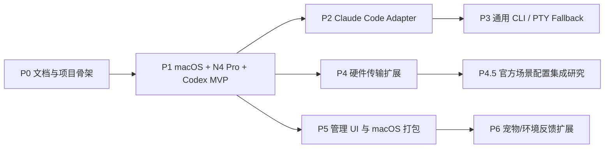

# Agent Deck Roadmap

状态：长期参考，随项目推进动态更新
用途：后续工作拆分、模块依赖、阶段目标

## 路线原则

1. 先打通一个可靠闭环，再扩 Agent 和硬件。
2. 状态采集、状态归约、硬件渲染、反向动作必须分层。
3. 高风险动作默认关闭，显式配置后才启用。
4. 每个阶段都保留 fake adapter，避免真实硬件或真实 Agent 成为唯一测试方式。
5. 安装器必须可 dry-run、可备份、可卸载。

## 阶段总览

阶段顺序表示建议依赖，不代表固定时间表。每次迭代可以按当前需求重新调整。

## P0：文档与项目骨架

目标：

- 明确需求、MVP 设计和路线图。
- 初始化项目仓库。
- 选择第一版技术栈。
- 写出可执行 implementation plan。

交付：

- `2026-06-12-agent-deck-analysis.md`
- `2026-06-12-agent-deck-mvp-design.md`
- `docs/references/agent-deck-roadmap.md`
- Gemini 粘贴报告归档到 `docs/references/`
- Stream Dock 场景配置研究摘记归档到 `docs/references/`
- `uv` 项目配置
- Python package skeleton。
- 基础测试命令。

验收：

- 用户确认 spec。
- 有明确下一步实现计划。

## P1：macOS + N4 Pro + Codex MVP

目标：

- 完成第一版最快闭环。
- 能在 N4 Pro 上展示 Codex 状态。
- 能通过 N4 Pro 选择和聚焦 Agent。
- 能通过 N4 Pro 响应 Codex PermissionRequest。

模块：

- `agent_deck.core.events`
- `agent_deck.core.state`
- `agent_deck.core.decisions`
- `agent_deck.adapters.codex`
- `agent_deck.hardware.streamdock`
- `agent_deck.hardware.fake`
- `agent_deck.rendering.n4pro`
- `agent_deck.actions.macos`
- `agent_deck.cli`
- `agent_deck.config`
- `agent_deck.core.modes`

可拆任务：

1. 项目初始化
   使用 `uv` 建立 Python 包、虚拟环境、测试框架、lint、typing、基础 CLI。

2. 配置与路径
   定义用户配置、cache、日志、runtime state 路径。

3. fake hardware
   先实现可测试硬件接口，模拟 key/knob/touch/led。

4. Codex OTel receiver
   接收 OTLP HTTP，解析 Codex 日志为内部事件。

5. Codex hook helper
   command hook 从 stdin 读 JSON，发送到 `agent-deckd`，必要时等待决策。

6. Codex notify helper
   作为 fallback 接收 `agent-turn-complete`。

7. Codex App local state scanner
   只读扫描 `~/.codex/state_*.sqlite` 和 thread rollout JSONL，检测 Plan Mode
   `request_user_input` 是否仍未出现 `function_call_output`，并映射为 `input.requested`。
   该能力作为 Codex App 私有本地状态 fallback，不替代官方 hooks；daemon 默认以 5 秒间隔
   自动轮询，可通过 CLI 关闭或调整间隔。

8. state reducer
   把事件归约为 AgentState。

9. DeckMode 和 layout plan
   建立 `overview`、`agent_detail`、`decision`、`quick_prompt`、`settings` 内部运行场景，并输出硬件无关的 layout plan。

10. decision broker
   支持 pending decision、timeout、allow、deny、cleanup。

11. N4 Pro driver
   枚举设备、初始化、按键图标、触屏背景、LED、输入回调、断线恢复。

12. N4 Pro renderer
    根据 DeckMode 生成 slot icons、详情屏、决策界面、LED 聚合状态。

13. Codex 视觉资产生成器
    将 `assets/codex/codex.gif` 按目标设备 profile 预渲染成状态帧序列、每状态
    `preview.gif` 和 `manifest.json`。动态图标遵循官方图标包建议：10-20fps、
    理想情况下 5 秒以内；第一版 N4 Pro key profile 默认 10fps，并保留完整动画周期的
    时间轴重采样，而不是截取源 GIF 前几帧。

14. Codex quota poller + N4 Pro touch panel
    通过 Codex app-server 读取 quota，默认 5 分钟刷新一次；成功后保存 runtime snapshot，
    渲染到底部 N4 Pro touch-bar viewport，并默认下发到 `streamdock_quota_device=n4pro`。
    渲染层显示剩余百分比，不改 adapter 的 `used_percent` 原始语义。未来没有触屏能力的设备
    应通过 device profile 禁用该 panel 或切换到其他显示方式。

15. action executor
    实现 focus target、tmux、AppleScript 激活、递归熔断。

16. installer / doctor
    检查 Codex 配置、SDK、设备权限、端口占用、官方软件设备占用，提供 dry-run patch。
    Codex 安装器保留 user-level 默认模式，并提供 `--managed-system` 高级模式：写系统
    `/etc/codex/requirements.toml` managed hooks、设置 `[hooks].managed_dir`、安装稳定
    wrapper、清理用户级重复 Agent Deck hooks；正式写入前提供 `--validate-only` 只读检查。

17. 手动验收脚本
    提供模拟事件和真实 Codex 验证步骤。

P1 验收清单：

- 无硬件时 fake hardware 测试通过。
- 有 N4 Pro 时 `doctor` 能识别设备。
- `doctor` 能识别或提示官方 Stream Dock 软件占用设备的情况。
- Codex turn 状态能显示到 slot。
- PermissionRequest 能在硬件上显示并返回 allow/deny。
- Codex App Plan Mode `request_user_input` 未完成时能被只读扫描为 `waiting_user`。
- Codex quota 能自动刷新到 daemon runtime，并显示到 N4 Pro 底部虚拟视窗。
- 超时默认策略按配置执行。
- 拔插设备服务不崩溃。
- `pytest` 通过。

## P2：Claude Code Adapter

目标：

- 接入 Claude Code hooks。
- 支持 HTTP hooks 或 command hooks。
- 复用 P1 的 normalized event、state reducer、decision broker 和 renderer。

可拆任务：

1. Claude hook schema 样例收集。
2. Claude HTTP ingress。
3. Claude command helper fallback。
4. PermissionRequest / Elicitation 映射。
5. SubagentStart / SubagentStop 映射。
6. 与 Codex 并行运行的 slot 分配策略。
7. Claude adapter 测试和安装器。

P4.5 关键设计点：

- Claude HTTP hook 超时不是 fail-closed，服务必须主动返回 deny。
- Elicitation 适合映射到 N4 Pro 触屏/上下文按键。
- Claude Code 的 subagent 信息比 Codex 更丰富，可以作为任务树显示的第一批扩展。

## P3：Generic CLI / PTY Fallback

目标：

- 支持没有标准 hooks/telemetry 的 CLI Agent。
- 通过 PTY wrapper 捕获 stdout/stderr 模式，并把硬件输入写回 stdin。

可拆任务：

1. PTY supervisor。
2. 输出模式检测规则。
3. 用户可配置 regex -> NormalizedEvent。
4. 硬件按键 -> stdin 写入。
5. 安全策略：禁止自动向未知进程发送敏感输入。
6. tmux pane 绑定。
7. 记录和回放 PTY 测试 fixture。

风险：

- 文本解析容易误判。
- 多语言输出和主题样式会影响匹配。
- 只能作为 fallback，不应该覆盖有官方 hooks 的 Agent。

## P4：硬件传输扩展

目标：

- 支持更多妙联宝设备。
- 支持 WebSocket SDK transport。
- 将设备能力 profile 独立配置。

可拆任务：

1. `HardwareSurface` 接口稳定化。
2. `StreamDockPythonTransport`。
3. `StreamDockWebSocketTransport`。
4. N1/N3/N4/M3/M18/XL/K1 Pro profile。
5. 旧设备并发限制适配。
6. 多设备选择和 fallback。
7. 硬件 capability simulator。

## P4.5：官方场景配置集成研究

目标：

- 明确 Agent Deck 与 Stream Dock 官方场景配置的边界。
- 判断是否能自动导入、创建或切换官方 `Agent Deck` 场景。
- 给出官方软件共存或独占控制策略。

可拆任务：

1. 实测 N4 Pro 上官方软件运行时 Python HID 是否能打开设备。
2. 实测退出 `agent-deckd` 后官方软件场景是否自动恢复。
3. 研究官方场景导出文件格式，判断是否可生成可导入的 `Agent Deck` 场景。
4. 研究官方软件的“应用智能跟随”是否可绑定 Codex、Terminal、iTerm2、Warp 或 Agent Deck daemon。
5. 研究 Plugin SDK 是否存在未文档化或新版的场景切换 API。
6. 如可行，制作 `Agent Deck` 官方场景模板；如不可行，写手动配置教程。

P4.5 关键设计点：

- 官方场景是入口和用户熟悉的配置层，不是 Agent Deck 动态状态机。
- Agent Deck 内部 DeckMode 仍是动态展示和审批交互的主路径。
- 不能假设所有设备或所有平台都有相同场景能力。

P4 关键设计点：

- 旧 293/293s 刷新图像时不能同时响应按键，renderer 必须降低刷新频率。
- 不同设备的 key image size、rotation、touchscreen 支持不同，必须由 profile 提供。
- 官方图标包规格支持 128x128 GIF/WEBP 动态图标，并建议 10-20fps、5 秒以内；
  Python SDK 直连路径仍按设备 profile 主动下发静态帧，所以 renderer 需要把官方建议转换为
  每个设备的实际刷新策略。

## P5：管理 UI 与 macOS 打包

目标：

- 让项目从开发者脚本变成可长期运行的本机工具。

可拆任务：

1. 本地 Web 管理页。
2. session/slot 可视化。
3. 配置编辑和 dry-run preview。
4. 日志查看。
5. macOS LaunchAgent。
6. 菜单栏状态。
7. 权限引导：Accessibility、Automation、设备访问。
8. 打包和自动更新策略。

## P6：宠物/环境反馈扩展

目标：

- 把 Codex/Claude 的宠物机制或类似 ambient feedback 接入硬件，但不污染核心状态机。

可拆任务：

1. `AmbientSurface` 抽象。
2. 宠物状态 adapter。
3. N4 Pro 触屏小动画。
4. LED 动效规则。
5. 用户可选 theme pack。

约束：

- 宠物只是 presentation，不是核心状态来源。
- 宠物动作不得影响审批和安全决策。

## 长期模块清单

### Core

- `event_bus`
- `normalizer`
- `state_store`
- `state_reducer`
- `decision_broker`
- `deck_mode`
- `intent_router`
- `config`
- `audit_log`

### Agent adapters

- `codex`
- `claude_code`
- `generic_pty`
- `gemini_cli`
- `cursor`
- `opencode`
- `mcp_agent`

### Hardware

- `fake`
- `streamdock_python`
- `streamdock_websocket`
- `n4pro_profile`
- `generic_keypad_profile`

### Rendering

- `icon_renderer`
- `touchscreen_renderer`
- `virtual_panel`
- `n4pro_background_composer`
- `layout_plan`
- `layout_engine`
- `asset_cache`
- `render_queue`

### Actions

- `focus`
- `tmux`
- `macos_window`
- `clipboard`
- `quick_prompt`
- `decision_response`

### Tooling

- `doctor`
- `install`
- `uninstall`
- `simulate`
- `status`
- `codex-detect`
- `codex-install`
- `logs`

## 决策 backlog

1. `codex-install` 已默认 dry-run，`--apply` 仅在无人工合并冲突时写入；已有非 Agent Deck
   `notify` 会通过 Agent Deck fan-out wrapper 保留；managed-system 路径增加
   `--validate-only` 检查，后续需要补 uninstall/rollback。
2. 是否允许用户把 PermissionRequest helper 的服务不可达策略从默认 deny 改成 fall-through？
3. Codex Desktop App 的 OTel 表现是否和 CLI 一致，需要实测。
4. 第一版聚焦目标优先支持 Terminal、iTerm2、Warp 还是 Codex App？
5. 快捷 prompt 是否第一版启用自动输入，还是只复制到剪贴板？
6. N4 Pro 触摸屏是否需要中文字体，还是第一版全英文短标签？
7. 是否需要 SQLite 保存状态，还是 P1 只用内存加 JSONL audit？
8. 是否需要菜单栏 App，还是 P1 仅 CLI + daemon？
9. 第一版是否采用 Agent Deck 独占控制模式，还是要求与官方 Stream Dock 软件共存？
10. 是否为官方 `Agent Deck` 场景提供手动配置教程或可导入模板？
11. 官方“应用智能跟随”是否绑定 Codex/Terminal/Codex App，还是绑定 Agent Deck 管理页？

## 下一次工作建议

下一次进入实现前，建议先做两件事：

1. 确认 P1 开放问题中的默认策略。
2. 写 implementation plan，把 P1 拆成小 PR/commit 节点。

建议第一个实现节点：

- 用 `uv` 初始化 Python 项目。
- 建立 core event/state/decision 的纯内存模型。
- 建立 fake hardware。
- 建立 DeckMode 和 layout plan。
- 用模拟 Codex 事件跑通状态到 fake surface 的测试。

这个节点不依赖真实 N4 Pro，也不修改 Codex 配置，风险最低。
