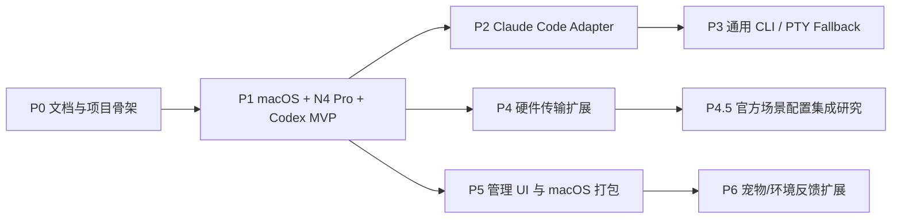

# Agent Deck Roadmap

状态：长期参考，随项目推进动态更新
用途：后续工作拆分、模块依赖、阶段目标

## 路线原则

1. 先打通一个可靠闭环，再扩 Agent 和硬件。
2. 状态采集、状态归约、硬件渲染、反向动作必须分层。
3. 高风险动作默认关闭，显式配置后才启用。
4. 每个阶段都保留 fake adapter，避免真实硬件或真实 Agent 成为唯一测试方式。
5. 安装器必须可 dry-run、可备份、可卸载。

## 阶段总览

阶段顺序表示建议依赖，不代表固定时间表。每次迭代可以按当前需求重新调整。

## P0：文档与项目骨架 (已完成)

目标：

- [x] 明确需求、MVP 设计和路线图。
- [x] 初始化项目仓库。
- [x] 选择第一版技术栈。
- [x] 写出可执行 implementation plan。

交付：

- `2026-06-12-agent-deck-analysis.md`
- `2026-06-12-agent-deck-mvp-design.md`
- `docs/references/agent-deck-roadmap.md`
- Gemini 粘贴报告归档到 `docs/references/`
- Stream Dock 场景配置研究摘记归档到 `docs/references/`
- `uv` 项目配置
- Python package skeleton。
- 基础测试命令。

验收：

- [x] 用户确认 spec。
- [x] 有明确下一步实现计划。

## P1：macOS + N4 Pro + Codex MVP (已完成)

目标：

- 完成第一版最快闭环。
- 能在 N4 Pro 上展示 Codex 状态。
- 能通过 N4 Pro 选择和聚焦 Agent。
- 能通过 N4 Pro 响应 Codex PermissionRequest。

模块：

- `agent_deck.core.events`
- `agent_deck.core.state`
- `agent_deck.core.decisions`
- `agent_deck.adapters.codex`
- `agent_deck.hardware.streamdock`
- `agent_deck.hardware.fake`
- `agent_deck.rendering.n4pro`
- `agent_deck.actions.macos`
- `agent_deck.cli`
- `agent_deck.config`
- `agent_deck.core.modes`

可拆任务：

1. 项目初始化
   使用 `uv` 建立 Python 包、虚拟环境、测试框架、lint、typing、基础 CLI。

2. 配置与路径
   定义用户配置、cache、日志、runtime state 路径。

3. fake hardware
   先实现可测试硬件接口，模拟 key/knob/touch/led。

4. Codex OTel receiver
   接收 OTLP HTTP，解析 Codex 日志为内部事件。

5. Codex hook helper
   command hook 从 stdin 读 JSON，发送到 `agent-deckd`，必要时等待决策。

6. Codex notify helper
   作为 fallback 接收 `agent-turn-complete`。

7. Codex App local state scanner
   只读扫描 `~/.codex/state_*.sqlite` 和 thread rollout JSONL，检测 Plan Mode
   `request_user_input` 是否仍未出现 `function_call_output`，并映射为 `input.requested`。
   同一扫描链路也筛选“未归档 + 最近 1 小时 + 最多 10 个 + 排除明显测试 thread”的有效
   Codex App 会话，把 waiting/running/idle 观测态幂等同步到 daemon state store。该能力作为
   Codex App 私有本地状态 fallback，不替代官方 hooks；daemon 默认以 5 秒间隔自动轮询，
   可通过 CLI 关闭或调整间隔、窗口、扫描上限和会话数量。被动扫描得到的 idle 是弱信号，
   不应立即覆盖同一 session 刚由 hook 推入的 thinking/running_tool 状态，避免用户正在看的
   working 动画被本地扫描打断。

7.1 ChatGPT App SSH Remote observer
   Agent Deck 只从 ChatGPT Settings 的 managed connections 中取
   `auto-connect=true` 的 SSH 项，动态建立独立、可复用的 `codex app-server proxy` 连接；
   不自行读取 `~/.ssh/config`，不使用历史 project/selected host，也不连接 false/missing 项。
   设置关闭或不可判定时立即 fail-closed，关闭对应 observer 并清理其状态。协议常态只调用
   `initialize/initialized/thread-list(useStateDbOnly=true)`；仅当 PETS 面板选择“读取远端配置”
   时增加只读 `config/read`，并立即只投影 `desktop.selected-avatar-id`。内置宠物 ID 是
   `fireball`、`null-signal` 这类名字型注册 ID，不是序号；`builtin_random` 不读取远端选择，
   诊断必须明确标记为随机分配。其余 config、preview、turn、item 和 rollout path，只保留顶层
   App thread 的 host-aware 粗粒度状态；本地 SQLite 仍严格限定 `source=vscode`，rollout
   metadata 兼容顶层 `thread_source=user|vscode`，继续排除 CLI、subagent 和有 parent 的 child。
   本地与不同 host 使用
   不冲突的 agent identity；active/waiting/error 可参与 App Key 宠物覆盖，active->idle 仅产生
   有界完成反馈，冷 idle/notLoaded 不覆盖原图标。连接持续失败超过 stale 窗口时清理该 host
   的 observer-owned 状态。OpenAI 中转 Remote 没有公开第三方 status API，当前不逆向接入。

8. state reducer
   把事件归约为 AgentState。

9. DeckMode 和 layout plan
   建立 `overview`、`agent_detail`、`decision`、`quick_prompt`、`settings` 内部运行场景，并输出硬件无关的 layout plan。

10. decision broker
   支持 pending decision、timeout、allow、deny、cleanup。

11. N4 Pro driver
   枚举设备、初始化、按键图标、触屏背景、LED、输入回调、断线恢复。

12. N4 Pro renderer
    根据 DeckMode 生成 slot icons、详情屏、决策界面、LED 聚合状态。

13. Hardware ops
    提供 `agent-deckctl hardware status` 通用只读诊断，并把 N4 Pro 默认图重写收敛到
    `agent-deckctl hardware n4pro splash` 这类设备专属动作。通用诊断应报告硬件族、
    已识别设备、占用进程和可用运维命令；具体写屏、重置、亮度等动作再放到对应设备子命令。
    当前 daemon 默认执行真实硬件渲染，`agent-deck.toml` 的默认 device profile 是 `n4pro`：
    内部 N4 Pro renderer 从 runtime layout
    读取前 10 个 Codex agent slot 的 `VisualIconSpec.variant_id`，加载
    `assets/codex/generated/n4pro-key-112-fps10/` 下的预渲染帧，并在同一次 N4 Pro 设备会话里
    下发 quota 背景和按键动画。该模式默认替代旧的 quota-only 真实触屏下发，避免
    多个 SDK `init()` 路径互相清屏；需要纯内存/fake 运行时可用 `--disable-hardware-renderer`。
    渲染间隔、FPS、设备 profile 和帧目录默认值放在 `agent-deck.toml`，CLI 只提供通用覆盖项。
    当前默认节奏为 3 秒一次、10fps，对齐 30 帧 N4 Pro key 动画资产的完整周期。
    render loop 必须把单次硬件播放耗时抵扣进周期，不能“播完 3 秒再 sleep 3 秒”，否则
    working 动画会在终点出现肉眼可见的停顿。daemon 默认使用 persistent N4 Pro renderer
    sink，在服务生命周期内复用同一个 open/init 后的设备会话；CLI 一次性预览命令仍可使用
    open/play/close 的短会话路径。
    persistent renderer 每轮都会重新枚举设备；只有 USB path 相同且当前 transport `can_write`
    明确可用时才复用旧会话。设备消失、同 path 原地重启或 SDK 写入/refresh 返回非零
    TransportResult 时，renderer 会 `close(notify=False)` 使旧句柄失效，并在后续轮次用新枚举对象
    重新执行 raw HID `HAN` 握手、open/init、注册输入回调和 full redraw。N4 Pro 握手使用
    `report_id=0` 的 1025 字节输出报告，可让设备从只显示品牌图的断开状态回到 SDK 控制模式；
    安全只读 probe 不发送握手。vendored SDK 的 legacy 背景、刷新、亮度和灯光 API 必须透传
    native 返回码，不能只打印 `Device is disconnected` 后仍让 daemon 记录成功。macOS 受限运行
    策略还可能让 SDK 的 open/can_write/返回码全部假成功，因此真实 smoke 必须验证 raw HID 握手，
    Codex Desktop 调试需启用 Full Access 并重启，仍报 `not permitted` 时检查输入监控权限。

13. Codex 视觉资产生成器
    将 `assets/codex/codex.gif` 按目标设备 profile 预渲染成状态帧序列、每状态
    `preview.gif` 和 `manifest.json`。动态图标遵循官方图标包建议：10-20fps、
    理想情况下 5 秒以内；第一版 N4 Pro key profile 默认 10fps，并保留完整动画周期的
    时间轴重采样，而不是截取源 GIF 前几帧。

14. Codex quota poller + N4 Pro touch panel
    通过 Codex app-server 读取 quota，默认 5 分钟刷新一次；成功后保存 runtime snapshot，
    渲染到底部 N4 Pro touch-bar viewport，并默认交给真实硬件 renderer 下发。这个 viewport
    是 Agent Deck 的 logical panel，不是 quota 专用屏；第一批 panel kind 为 `quota`、
    `tokens`、`pets`、`message`，其中 `message` 承载审批详情、host context 或系统提示等复杂文字。
    Codex 宠物功能启用时，手动轮换顺序为 `brand -> quota -> tokens -> pets -> brand`；关闭
    宠物功能时从顺序中移除 `pets`，`message` 始终不进入普通轮换。daemon 默认启用 token usage
    poller，tokens 面板通过
    `ccusage codex daily --compact --json` 读取 Codex token usage，聚合 today/week/month/all。
    `/logical-panel/input` 提供归一化 panel 事件入口，`/hardware/input` 提供低层 `HardwareInput`
    入口。旋钮事件按用户保存的 per-control rotate binding 映射为 intent；按下静音语义从输出/输入
    音量用途隐式派生，不再硬编码为
    knob 4 token 周期切换；Quota 内容切换 5h/Week，Usage 内容切换 Day/Week/Month/All，Brand
    内容切换安静 no-op。连续系统控制固定每格 2%。默认 persistent N4 Pro renderer 在同一 SDK
    设备会话中注册 key/touch callbacks，并同时恢复控制台整体亮度、应用唯一 `rotary_ring_group`
    基础色，避免多次 `init()` 造成清屏或亮度复位。
    Usage touch bar 采用“金额 + 总 Token + 单条周期色历史趋势 + 四项 Token 细则”的紧凑布局；
    曲线与 usage status key 共用 ccusage daily raw 的周期聚合与 Day/Week/Month/All 身份色。
    任意数量的可见 quota 窗口和 Usage 四周期的完整背景图在快照更新时预渲染到进程内缓存；状态型
    主键也复用同一 quota/usage 数据并预渲染为 112x112 图片。输入只选择缓存图、递增对应 revision。
    persistent renderer 是唯一 HID 写入者，输入线程只唤醒其帧间等待；背景和静态主键差异都以
    latest-wins 和短合并窗口下发，避免输入高频时排队旧显示。
    `/status` 的 `streamdock_input.recent_events` 和 `interaction.recent` 保留最近输入与
    业务 intent/action 的小型 ring buffer，用于真实硬件现场调试按键序列。
    实测 N4 Pro 的 10 个主物理按键在 SDK button event 中上报为 `key=11..20`，
    映射到 Agent Deck layout index `0..9`；不要按通用 1-based `1..10` 解释。
    渲染层显示剩余百分比，不改 quota adapter 的 `used_percent` 原始语义。未来没有触屏能力的
    设备应通过 device profile 禁用该 panel 或切换到其他显示方式。若 daemon 禁用真实硬件
    renderer，则可回退到 quota-only 真实硬件 sink 或纯 fake surface。

15. action executor
    实现 focus target、tmux、AppleScript 激活、递归熔断。focus target 必须区分
    execution host 与 presentation client：tmux 是 Codex CLI 的会话/进程宿主，
    不是 Terminal、iTerm2、Ghostty、Otty 这类终端 App 的同级枚举。若 Codex CLI
    运行在 tmux pane 中，`focus_target` 应优先保存 tmux pane id/session/window/pane
    等结构化目标；终端 App 只是 attach 或展示现有 tmux client 的手段。
    当前已完成第一段硬件反向链路：低层 key/button 输入结合当前 `LayoutPlan.keys`
    映射为 `InteractionIntent`，主 agent slot 会更新 `DeckSelection.selected_agent_key`
    并立即尝试 focus 该 agent；缺少 `focus_target` 时记录 `missing_target` 诊断。
    approval action key 会把
    `approve_request` / `deny_request` 写入 decision broker，并在 pending decision 出现时
    以 transient override 方式显示 `message` 中的工具、Agent 和原因；pending 清空后恢复此前
    人工选择的 logical panel，不把 PETS、Quota 等选择改写为 MESSAGE。
    state 会保存事件 payload 里的
    `focus_target`，默认对 `app:<AppName>` 目标调用 AppleScript 激活 App；
    `[actions.focus].enabled = false` 仅作为排障关闭开关。tmux pane/window、terminal client
    attach、结构化 host context 和递归熔断仍属于后续扩展。

    已完成 N4 Pro 键盘快捷键扩展：`keyboard_shortcut` binding 支持一个 W3C 物理键、
    Command/Control/Option/Shift 组合键或最多 16 步的有序序列。强类型 shortcut 从
    `N4ProKeyBinding` 投影到 `KeyPlan` 和 `InteractionIntent`；macOS executor 只用公开
    AppKit/CoreGraphics API，在执行开始时固定前台 App PID，并通过单 worker、零等待队列调度。
    执行中再次按下返回 `busy`，权限缺失 fail-closed，系统授权只从配置页显式请求。所有路径
    都尽力补发 key-up；`succeeded` 只表示事件已投递。第一版明确排除 Fn、媒体键、Caps Lock、
    文本、鼠标、shell 和混合动作。

    配置页已支持连续录制与“停止并应用”、手动添加纯修饰键、重排/删除、0–2000ms 间隔、紧凑
    权限状态和悬停/点击详情，以及自动/自定义默认图标。Web 自动预览与硬件下发复用同一 renderer
    PNG；自定义图标以规范化 PNG SHA-256 内容寻址，限制 5 MiB 和 4096×4096，自定义资产缺失时
    自动回退组合键图。key layout store 已升级 v3 并兼容 v1/v2，旧布局默认没有任务态覆盖层，
    未知未来版本 fail-closed；
    `/status.keyboard_shortcuts` 暴露 capability、active 和 recent job。

16. installer / doctor
    检查 Codex 配置、SDK、设备权限、端口占用、官方软件设备占用，提供 dry-run patch。
    当前 `agent-deckctl doctor` 已提供只读本机诊断：输出 Agent Deck 版本、
    `AGENT_DECK_STREAMDOCK_SDK_PATH` 状态、安全 StreamDock SDK probe 结果、N4 Pro
    open/read 结果，以及常见硬件占用进程线索；该命令不调用 SDK `init()`、不渲染、不写文件、
    不停止任何进程。Codex 配置完整检查、端口占用检查和安装器 dry-run patch 仍属于后续扩展。
    Codex 安装器保留 user-level 默认模式，并提供 `--managed-system` 高级模式：写系统
    `/etc/codex/requirements.toml` managed hooks、设置 `[hooks].managed_dir`、安装稳定
    wrapper、清理用户级重复 Agent Deck hooks；正式写入前提供 `--validate-only` 只读检查。
    `agent-deckctl codex-hosts --json` 提供只读宿主探针，用于输出 Codex CLI/App、
    direct PTY、tmux pane、attached/detached client 和激活策略置信度。
    用户级 hooks 生成时应带 `_agent_deck=true` 私有标记，刷新或清理时优先按该标记识别
    Agent Deck entry，同时继续兼容旧版本 `agent-deck-codex-hook` command 字符串。
    Hook command 应捕获 Codex hook 运行时 `$PPID` 并作为 `agent_pid` 透传到 normalized
    payload，作为后续区分 CLI/App、direct PTY、tmux pane、attached/detached tmux
    presentation client 或多实例宿主的基础线索。

    Codex hooks 后续优化 backlog：

    - 评估 `full` / `light` 两种 hook profile：`full` 保留 `PreToolUse` / `PostToolUse`
      以区分 thinking 与 running tool；`light` 类似 otty，只保留 idle / processing /
      awaiting 的低侵入状态。
    - 评估 lifecycle hook 的快速返回路径：先完整读取 stdin，再通过本地 relay 或常驻
      IPC 客户端异步投递事件，避免每个高频 hook 都启动完整 Python/uv 进程。
    - 优先让 managed wrapper 使用当前虚拟环境里的 console script 或已安装可执行文件，
      仅在源码开发模式下回退到 `uv --directory ... run`，降低 hook 启动成本。
    - 为 hook latency、daemon event receive latency 和状态覆盖原因增加诊断日志，避免
      working 动画被延迟事件或本地 scanner 弱信号打断时难以定位。
    - 基于 hook 透传的 `agent_pid` 做宿主存活检测：当会话超过 idle TTL 但 PID 仍存在时
      可降级为 idle；PID 不存在时再隐藏或进入 offline 历史态。后续需要同时考虑 Codex CLI
      运行在 direct PTY、tmux pane、otty/Ghostty/Terminal presentation client，以及 Codex
      App 多会话时 pid 与 session 的绑定关系。tmux detached 时应输出可 reattach 的
      execution target；tmux attached 时应同时记录现有 client 并避免把终端 App 当成
      唯一事实来源。
    - PermissionRequest 的完整上下文采集保持显式 opt-in：默认 passthrough，只在用户启用
      handle 模式时传递经过脱敏的 request context 给 Agent Deck decision broker。

17. 手动验收脚本
    提供模拟事件和真实 Codex 验证步骤。

P1 验收清单：

- [x] 无硬件时 fake hardware 测试通过。
- [x] 有 N4 Pro 时 `doctor` 能识别设备。
- [x] `doctor` 能识别或提示官方 Stream Dock 软件占用设备的情况。
- [x] Codex turn 状态能显示到 slot。
- [x] PermissionRequest 能在硬件上显示并返回 allow/deny。
- [x] Codex App Plan Mode `request_user_input` 未完成时能被只读扫描为 `waiting_user`。
- [x] Codex App 最近有效会话能被只读扫描同步到 daemon，并按 running/idle/waiting 状态显示到 slot。
- [x] SSH Remote ChatGPT App 顶层任务可经独立只读 app-server proxy 合并到 daemon；自动主机
  严格跟随 Settings 中 enabled connection，CLI/child 被过滤，preview/turn/item 不进入模型
  或诊断，设置关闭、发现失败或失联会恢复原 App 图标。
- [x] Codex quota 能自动刷新到 daemon runtime，并显示到 N4 Pro 底部虚拟视窗。
- [x] 启用统一 N4 Pro renderer 后，Codex 会话状态按钮和底部 quota 背景能在同一次硬件写入链路中共存。
- [x] 超时默认策略按配置执行。
- [x] 拔插设备服务不崩溃。
- [x] 设备以相同 USB path 重启或重新插入后，失效句柄会被识别并在后续 renderer 周期重连。
- [x] 主按键可发送受限单键、组合键或序列，并固定执行开始时的前台 App。
- [x] 键盘权限只在显式 UI 操作时请求，缺权限与 executor busy 均 fail-closed 且可诊断。
- [x] 快捷键自动图标、自定义内容寻址图标与缺失资产 fallback 可用于配置预览和 N4 Pro 渲染；
  Web 自动预览与硬件下发使用同一 renderer PNG。
- [x] `pytest` 通过。

## P2：Claude Code Adapter

目标：

- 接入 Claude Code hooks。
- 支持 HTTP hooks 或 command hooks。
- 复用 P1 的 normalized event、state reducer、decision broker 和 renderer。

可拆任务：

1. Claude hook schema 样例收集。
2. Claude HTTP ingress。
3. Claude command helper fallback。
4. PermissionRequest / Elicitation 映射。
5. SubagentStart / SubagentStop 映射。
6. 与 Codex 并行运行的 slot 分配策略。
7. Claude adapter 测试和安装器。

P4.5 关键设计点：

- Claude HTTP hook 超时不是 fail-closed，服务必须主动返回 deny。
- Elicitation 适合映射到 N4 Pro 触屏/上下文按键。
- Claude Code 的 subagent 信息比 Codex 更丰富，可以作为任务树显示的第一批扩展。

## P3：Generic CLI / PTY Fallback

目标：

- 支持没有标准 hooks/telemetry 的 CLI Agent。
- 通过 PTY wrapper 捕获 stdout/stderr 模式，并把硬件输入写回 stdin。

可拆任务：

1. PTY supervisor。
2. 输出模式检测规则。
3. 用户可配置 regex -> NormalizedEvent。
4. 硬件按键 -> stdin 写入。
5. 安全策略：禁止自动向未知进程发送敏感输入。
6. tmux pane 绑定。
7. 记录和回放 PTY 测试 fixture。

风险：

- 文本解析容易误判。
- 多语言输出和主题样式会影响匹配。
- 只能作为 fallback，不应该覆盖有官方 hooks 的 Agent。

## P4：硬件传输扩展

目标：

- 支持更多妙联宝设备。
- 支持 WebSocket SDK transport。
- 将设备能力 profile 独立配置。

策略参考：

- `docs/references/mirabox-device-capability-strategy.md`：按 capability profile 设计
  Mirabox / Stream Dock 设备支持，不按单一型号写死 Agent Deck 功能。

可拆任务：

1. `HardwareSurface` 接口稳定化。
2. `StreamDockPythonTransport`。
3. `StreamDockWebSocketTransport`。
4. N1/N3/N4/M3/M18/XL/K1 Pro profile。
5. 旧设备并发限制适配。
6. 多设备选择和 fallback。
7. 硬件 capability simulator。

## P4.5：官方场景配置集成研究

目标：

- 明确 Agent Deck 与 Stream Dock 官方场景配置的边界。
- 判断是否能自动导入、创建或切换官方 `Agent Deck` 场景。
- 给出官方软件共存或独占控制策略。

可拆任务：

1. 实测 N4 Pro 上官方软件运行时 Python HID 是否能打开设备。
2. 实测退出 `agent-deckd` 后官方软件场景是否自动恢复。
3. 研究官方场景导出文件格式，判断是否可生成可导入的 `Agent Deck` 场景。
4. 研究官方软件的“应用智能跟随”是否可绑定 Codex、Terminal、iTerm2、Warp 或 Agent Deck daemon。
5. 研究 Plugin SDK 是否存在未文档化或新版的场景切换 API。
6. 如可行，制作 `Agent Deck` 官方场景模板；如不可行，写手动配置教程。

P4.5 关键设计点：

- 官方场景是入口和用户熟悉的配置层，不是 Agent Deck 动态状态机。
- Agent Deck 内部 DeckMode 仍是动态展示和审批交互的主路径。
- 不能假设所有设备或所有平台都有相同场景能力。

P4 关键设计点：

- 旧 293/293s 刷新图像时不能同时响应按键，renderer 必须降低刷新频率。
- 不同设备的 key image size、rotation、touchscreen 支持不同，必须由 profile 提供。
- N4 Pro 的 `KEY_COUNT = 15` 是 SDK logical key slot 数，不是 15 个物理主按钮。profile
  应拆出 physical main keys、logical key slots、secondary soft-key slots、touch display
  和 rotary controls，避免把下方 logical panel、secondary screen slot 与旋钮按下混成同一类。
- 官方图标包规格支持 128x128 GIF/WEBP 动态图标，并建议 10-20fps、5 秒以内；
  Python SDK 直连路径仍按设备 profile 主动下发静态帧，所以 renderer 需要把官方建议转换为
  每个设备的实际刷新策略。

## P5：管理 UI 与 macOS 打包

目标：

- 让项目从开发者脚本变成可长期运行的本机工具。

可拆任务：

1. [x] 本地 Web 管理页（当前覆盖 N4 Pro 主键、快捷键、状态键、旋钮与灯光配置）。
2. session/slot 可视化。
3. 配置编辑和 dry-run preview。
4. 日志查看。
5. 签名的 `Agent Deck.app`：安装、首次启动、菜单栏状态、打开配置页与升级入口。
6. 用 `SMAppService` 注册用户级 `Agent Deck Agent` LaunchAgent，承载当前 daemon、N4 Pro、
   用户级 Codex hooks 和需要前台用户会话的动作；tmux/Python launcher 继续作为开发模式。
7. 将 macOS 辅助功能权限授予 `Agent Deck Agent`，而不是浏览器；首次启动页分别展示
   Accessibility、后台运行、设备访问和用户级 Codex 集成状态。
8. 为 managed-system Codex hooks 增加按需、最小权限的 `Agent Deck Privileged Installer`
   LaunchDaemon，只允许校验过的 `/etc/codex/requirements.toml` 与
   `/usr/local/lib/agent-deck/...` 安装/更新/卸载操作，不持有 Accessibility。
9. App、Agent 与 Privileged Installer 使用签名校验的 XPC/受限 IPC；生产版不能把当前开放的
   localhost HTTP 路由直接当作高权限信任边界，也不得接受任意路径、shell 或未建模动作。
10. 打包、Developer ID 签名、公证、安装镜像和自动更新策略。

P5 macOS 产品化边界：

- `Agent Deck.app` 是用户安装和交互的产品主体，不直接把浏览器升级成有权限的宿主。
- `Agent Deck Agent` 是用户级常驻服务，可以写用户自己的 `~/.codex` 配置并执行硬件/快捷键能力；
  修改 hooks 仍需产品内显式确认、dry-run、备份和回滚，不能把 Accessibility 当作文件写入授权。
- `Agent Deck Privileged Installer` 只服务 managed-system 模式。管理员批准、后台运行批准和
  Accessibility 是彼此独立的系统授权，不用一个模糊的“执行权限”状态合并展示。

## P6：宠物/环境反馈扩展（Codex 首版实施范围）

目标：

- 只读跟随 Codex 的全局宠物选择，并把本地与远端顶层 ChatGPT App 活动任务作为独立角色投影到
  N4 Pro PETS 虚拟面板，但不污染核心状态机、审批或任务执行。
- ChatGPT Desktop 内置宠物只从本机已安装 App 读取；本地 custom 从本机 Codex 目录读取，
  Remote SSH custom 只从 Agent Deck 自有的受限镜像缓存读取，不重新分发 App 素材。

当前实现范围：

1. 新增 `[codex.pet]` 配置，提供启用开关、只读刷新间隔、PETS 最高 FPS，以及
   `auto | full | reduced` 动效模式；不提供 Agent Deck 独立 `pet_id`。
2. 按 `CODEX_HOME`、再 `~/.codex` 读取 Codex 全局 `selected-avatar-id`，兼容旧版顶层字段和当前
   `[desktop]` 字段；`custom:<name>` 优先使用 `pets/<name>/pet.json`，兼容旧
   `avatars/<name>/avatar.json`。
3. 安全解析位于宠物目录内的 `spritesheetPath`，拒绝绝对路径、`..` 和符号链接逃逸；兼容
   `1536×1872` 的 v1 8×9 与 `1536×2288` 的 v2 8×11 固定图集，但首版不使用 gaze 行。
4. 同一选择 ID 短暂读取失败时保留 last-known-good；选择 ID 改变却解析失败时不冒充旧宠物。
   内置宠物通过已安装 ChatGPT/Codex App 的 `app.asar` header 按 offset 只读发现，按活动角色
   解码到内存，不扫描其他 App、不解包到磁盘或仓库。
5. 新增 `codex_pet` ambient key 类型：完整 cell 缩放到 `112×112` 深色画布，按下无 intent、
   不执行 action、不占 Agent slot，默认布局不自动占用键位。
6. 宠物启用时将 PETS 加入 `brand -> quota -> tokens -> pets` 手动轮换；不因 Codex 状态自动
   抢占面板。审批 MESSAGE 继续最高优先，但改为 transient override，结束后恢复人工选择。
7. 按 `Needs input > Blocked > Ready > Running > Idle` 聚合顶层 Codex 状态并排除 child agent。
   waiting、failed、review 各播放三轮后进入慢速 idle；`Ready` 首版以
   `COMPLETED_RECENTLY` 近似。同一状态时间戳不重复触发。
8. N4 Pro PETS 复用 `800×136` 虚拟面板与现有 persistent renderer。早期单角色控制器使用
   Running 约 15 秒全宽往返、Idle 约 30 秒驻留加 15 秒换边的确定周期；当前多角色行为以第 16 项
   的独立轨迹为准。两种路径都以 monotonic time 与累计帧时长采样，不另起 HID 会话或刷新循环。
9. `motion=auto` 尽力读取 macOS Reduce Motion；`reduced` 固定 idle 首帧、不横移。`/status`
   增加 `codex_pet` 的选择、解析、版本、activity、motion、更新时间和短错误诊断，不返回素材。
10. 配置页支持把任意按键设为“Codex 宠物”，完整保存/重载，并明确提示“仅展示、点击无动作”。
11. App 启动键可附加 `KeyAmbientOverlaySpec`，其字段固定为 `kind=codex_pet`、
    `scope=launch_target`、`visibility=task_active`，不改变 `open_or_focus_app` 动作或用户原图标。配置页只对当前
    `ChatGPT.app` 与历史 `Codex.app` 身份展示开关，后端按 OpenAI bundle id 或明确 App 路径复验，
    不按显示名独立放行。
12. App 覆盖只消费 `codex-app:*` 和旧 App target 的顶层 Desktop task，排除 CLI、child agent
    与其他 App；按 `Needs input > Error > Review > Running > Completed` 聚合。当前无显式 review
    状态源，普通 `COMPLETED_RECENTLY` 只播放三轮 `waving`、末帧保持 5 秒后恢复原 App 图标。
13. waiting/error/running（以及未来显式 review）持续播放直到状态解除；新高优先级状态立即打断完成
    反馈。`motion=reduced` 显示各状态静态代表帧但使用相同恢复规则；按下 App 键只打开/聚焦并记录
    调度排序，不确认提醒。
14. 任意多个关联 App 键共享素材、状态采样和帧缓存。默认总预算 10 key writes/s、动态键最低
    5 FPS，因而最多两个键动画；其余键静态降级。同级按最近按下时间、再按物理索引排序，只发布
    图像来源发生变化的 dirty key。`/status.codex_pet.app_overlay` 暴露关联/可见/动态/静态数量、
    有效 FPS 与预算。
15. renderer 保存独立基础图映射，再叠加独立宠物键与 App 任务覆盖；覆盖退出时复用同一 App 图标
    缓存对象，不清空或重绘 fallback。宠物关闭、素材缺失或图集失败时完整回退基础图且动作仍有效。
16. PETS 面板从全部顶层 `codex-app:*` 状态建立独立角色：每只宠物共享完整 800px 横向空间，
    使用由 agent key 派生的独立位置、方向、动画相位和基础速度；速度叠加错相低频包络持续细微
    变化，不固定匀速。碰撞只在周期窗口内短暂反弹，其余时间允许穿过，避免形成隐性领地。
17. 本地角色不画地垫；远端角色按 observer host id 使用稳定低饱和细光环。不同远端主机从预留
    色池映射，地垫只表达执行主机，不承载状态红绿语义。
18. N4 Pro 设备预览中的 touch bar 是 PETS 专属设置入口。设置持久化到独立用户级版本化 JSON，
    当前包含远端宠物来源 `follow_local | remote_config | builtin_random` 和巡游速度
    `slow | medium | fast`；未来 PETS 偏好继续在这里扩展，不进入单 Key binding。
19. `remote_config` 只对 ChatGPT Settings 中 managed 且 auto-connect=true 的现有 observer 打开
    `config/read`，只保留宠物 ID；切换其他策略即停止该额外 RPC。远端选择为本机可识别内置宠物
    时按名字型 ID 精确复用本机 App 素材。远端 `custom:<name>` 通过独立短生命周期系统 SFTP
    只读镜像 `.codex/pets/<name>/pet.json`（兼容 legacy avatar manifest）和其中声明的单张图集；
    下载前用 `ls -ln` 拒绝最终 symlink/非普通文件并限制大小，下载后再次校验相对路径、manifest、
    sprite 版本、图片解码和固定几何。内容寻址版本只写
    `~/Library/Application Support/AgentDeck/remote-pets/`，绝不写本机 `.codex`、不执行宠物代码、
    不上传或修改远端，也不复制整个目录。同 host + 同选择 ID 可使用最近成功缓存；选择变化、
    未知或校验失败不得冒充旧宠物，安全回退本机系统宠物。默认 5 分钟内复用本次解析，避免随
    5 秒任务状态轮询重复建立 SFTP。

当前明确不做：

- 不重新分发或提交 Codex App 内置宠物、Rick 等本机宠物及派生素材；只在运行时读取用户已安装 App。
- 不支持 Agent Deck 上传一套新的面板宠物、复制远端 custom 包的任意额外文件或目录、
  hover/jump、v2 gaze 或鼠标跟踪。
- 不替换现有 Agent 状态键，不让宠物按键打开 PETS，也不让宠物行为参与审批或执行。
- Codex CLI 启动联动不纳入本轮；后续必须单独建模 execution host 与 Terminal、iTerm2、Warp、
  Ghostty、Tabby 等 presentation client，不能把它们压成一个直接执行 `codex` 的 App key。

验收状态：

- 自动化范围包括资产、活动/时间轴、像素、配置 round-trip、面板轮换、MESSAGE 恢复、动态
  revision 与 fake hardware 单会话行为；以本轮最终测试记录为准，本节不预先标记通过。
- 真机必须使用当前 Rick 做 60 秒状态 smoke 和 15 分钟 soak，重新测量全宽约 15 秒往返、
  有效背景刷新不低于约 7 FPS、`open/init=1`、无非预期重连/HID 错误/CPU 或线程持续增长，并在
  结束时显式关闭且不遗留 `agent-deckd`。单宠物首版 901 秒 soak 的约 7.88 FPS 只作为旧基线，
  不算当前多角色实现的本轮证据。

后续可拆任务：

1. `AmbientSurface` 抽象。
2. Claude 或其他 Agent 的宠物/ambient 状态 adapter。
3. 持续跟踪 ChatGPT/Codex App 内置宠物的 ASAR 资源合同变化，并为不兼容版本保留安全降级。
4. v2 gaze、鼠标跟踪和显式宠物交互。
5. Codex CLI 的“执行宿主 + 终端展示客户端”复合启动/聚焦模型。
6. LED 动效规则。
7. 用户可选 theme pack 与更多硬件 profile。

约束：

- 宠物只是 presentation，不是核心状态来源。
- 宠物动作不得影响审批和安全决策。
- 素材坐标、动画时间轴和空间运动必须解耦；不得用逐 tick 累加造成掉帧后变慢。
- 真实硬件继续复用唯一 persistent renderer；fake adapter 仍是自动化测试的默认路径。

## 长期模块清单

### Core

- `event_bus`
- `normalizer`
- `state_store`
- `state_reducer`
- `decision_broker`
- `deck_mode`
- `intent_router`
- `config`
- `audit_log`

### Agent adapters

- `codex`
- `claude_code`
- `generic_pty`
- `gemini_cli`
- `cursor`
- `opencode`
- `mcp_agent`

### Hardware

- `fake`
- `streamdock_python`
- `streamdock_websocket`
- `n4pro_profile`
- `generic_keypad_profile`

### Rendering

- `icon_renderer`
- `touchscreen_renderer`
- `virtual_panel`
- `n4pro_background_composer`
- `layout_plan`
- `layout_engine`
- `asset_cache`
- `render_queue`

### Actions

- `focus`
- `tmux`
- `macos_window`
- `clipboard`
- `quick_prompt`
- `decision_response`

### Tooling

- `doctor`
- `install`
- `uninstall`
- `simulate`
- `status`
- `codex-detect`
- `codex-install`
- `logs`

## 决策 backlog

1. `codex-install` 已默认 dry-run，`--apply` 仅在无人工合并冲突时写入；已有非 Agent Deck
   `notify` 会通过 Agent Deck fan-out wrapper 保留；managed-system 路径增加
   `--validate-only` 检查，后续需要补 uninstall/rollback。
2. PermissionRequest helper 已默认 `passthrough`；后续需要补 `handle` 模式下硬件/CLI resolve
   闭环，以及是否允许 handle 模式在 daemon 不可达时回退到 passthrough。
3. Codex Desktop App 的 OTel 表现是否和 CLI 一致，需要实测。
4. 第一版聚焦目标优先支持 Terminal、iTerm2、Warp 还是 Codex App？
5. 快捷 prompt 是否第一版启用自动输入，还是只复制到剪贴板？
6. N4 Pro 触摸屏是否需要中文字体，还是第一版全英文短标签？
7. 是否需要 SQLite 保存状态，还是 P1 只用内存加 JSONL audit？
8. 是否需要菜单栏 App，还是 P1 仅 CLI + daemon？
9. 第一版是否采用 Agent Deck 独占控制模式，还是要求与官方 Stream Dock 软件共存？
10. 是否为官方 `Agent Deck` 场景提供手动配置教程或可导入模板？
11. 官方“应用智能跟随”是否绑定 Codex/Terminal/Codex App，还是绑定 Agent Deck 管理页？

## 下一次工作建议

当前优先收口 P6 多任务 PETS 与 App Key 覆盖扩展：

1. 先完成定向测试与 `uv run pytest -q`，将实际结果回填到交付记录，不用旧测试结果代替。
2. 在 fake hardware 通过后，以本机 custom 和 ChatGPT 内置宠物分别执行多角色 smoke；验证
   本地无地垫、不同 remote host 光环、慢中快三档、动态微变速、间歇碰撞和活动结束恢复。
   长时间 soak 继续记录有效 FPS、dirty-key 数、按键响应、HID 错误和原图标恢复。
3. 保持独立宠物 Key、PETS 面板和 App Key 覆盖三种展示并存；真机数据不足前不让宠物取代 Agent
   状态键，也不扩大到 Codex CLI 终端控制面。

P6 收口后恢复 P2（Claude Code Adapter）：先确认 N4 Pro slot 分配与交互策略，收集
SessionStart、PreToolUse、Notification、Stop 等 Hook Payload，再用 Mock 测试跑通 Claude 事件到
state reducer 和 layout 的映射链路。
