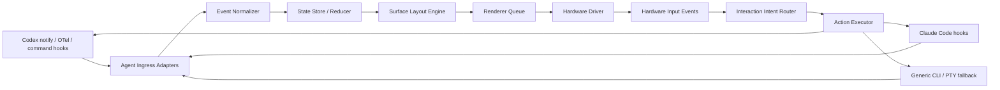

# Agent Deck 需求分析与总体结论

状态：草案  
日期：2026-06-12  
范围：总体需求、已验证事实、关键抽象、边界判断

## 背景

Agent Deck 的目标不是做一个固定快捷键面板，而是把妙联宝这类物理控制台变成本机 AI Agents 的状态面板和安全交互入口。它需要同时解决两类问题：

1. **观察问题**：用户同时运行多个 AI Agent 时，需要在不用盯着每个终端或窗口的情况下知道每个 Agent 当前处于什么状态。
2. **反馈问题**：当 Agent 需要用户决策、授权、选择选项或输入常用指令时，用户可以通过物理按钮、触屏、旋钮等方式快速响应。

项目第一版以 Codex 为主要 Agent，以 macOS 和妙联宝 N4 Pro 为目标硬件，但架构不能写死在这三者上。后续很可能要接入 Claude Code、Gemini CLI、Cursor、OpenCode、任意 PTY 包装的 CLI Agent，以及不同能力等级的妙联宝设备。

## 已验证事实

### 硬件与 SDK

妙联宝 SDK 提供两类集成路径：

1. **Python HID 直连模式**  
   Python SDK 通过 HID 与设备通信，支持设备枚举、热插拔、设置按键图标、设置触摸屏背景、亮度控制、按键回调和触屏回调。它适合第一版做本机常驻服务。

2. **WebSocket 网关模式**  
   Windows-WebSocket SDK 通过本地 WebSocket 代理桥接硬件，适合多语言、多进程或 Windows 场景。它不应该成为 macOS + N4 Pro 第一版的主路径，但应在传输层预留。

N4 Pro 的能力明显高于普通按键设备。当前 SDK 源码显示它支持：

- 15 个逻辑按键。
- 4 个旋钮。
- 旋钮按压。
- 左右滑动事件。
- 触摸点坐标。
- 800x480 触摸屏背景。
- 普通按键 112x112 图像。
- 次屏按键 176x112 图像。
- LED 亮度和颜色。

因此核心抽象不能是“按钮脚本”，而应该是“硬件表面”。按键、触屏、旋钮、LED 都只是硬件表面的不同区域和输入类型。

### Codex 能力面

Codex 不能只按“普通 CLI 输出解析”理解。当前官方文档和手册显示 Codex 有以下集成面：

- `notify`：外部通知命令，接收 Codex JSON payload，适合低成本处理 turn complete 之类事件。
- OpenTelemetry：可导出 API requests、SSE/events、prompts、tool approvals/results 等日志，适合构建细粒度状态。
- Hooks：支持 `SessionStart`、`PreToolUse`、`PermissionRequest`、`PostToolUse`、`UserPromptSubmit`、`SubagentStart`、`SubagentStop`、`Stop` 等事件。

重要限制：

- Codex 的 `notify` 和 `otel` 是本机用户级配置，项目级 `.codex/config.toml` 不能覆盖这些机器本地通知/遥测命令。
- Codex hooks 当前只运行 `type: "command"` handler，不能按 Claude Code 的 HTTP hook 方式直接写 `type: "http"`。
- 非 managed Codex hooks 需要用户 review/trust，安装流程必须把这一点当作显式步骤。

### Claude Code 能力面

Claude Code hooks 当前支持 command hooks 和 HTTP hooks。HTTP hooks 会收到 POST body，并可通过 HTTP response body 返回决策。

需要注意：Claude Code HTTP hook 的非 2xx、连接失败、超时属于非阻塞错误，会允许执行继续。因此如果 Agent Deck 要对某个审批 fail-closed，UCB 必须在 hook 自身 timeout 前返回一个 2xx 响应和明确 deny 决策，而不能依赖 HTTP timeout。

### 参考项目

Vibe Cat 的价值：

- 验证了 Claude Code hooks 和 Codex OTel 可以统一写入事件日志，再由 UI 轮询映射为状态。
- 证明了 Active / Idle / Offline / Permission pending 这类状态足够成为第一版状态基线。

PeonPing 的价值：

- 展示了多 Agent adapter 模式，把不同 Agent/IDE 映射到统一事件类型。
- 证明 `notify`、hooks、文件观察、MCP 主动调用可以共存。

Gemini 报告的价值：

- `Unified Control Bridge` 概念可保留。
- slot 动态分配、临时决策键、阻塞式审批、超时默认拒绝、递归熔断、图像缓存都应吸收进设计。

Gemini 报告的限制：

- 报告代码是伪实现，存在变量覆盖、锁手动释放、设备对象使用错误、SDK 方法名拼写错误、回调签名不匹配等问题，不能直接照抄。
- 报告把 Codex 主要归入 PTY 包装类外部 Agent，这个判断已不完整。Codex 第一版应优先使用 OTel、command hooks 和 notify。

## 总体结论

Agent Deck 应该被设计为一个本机常驻的 **Agent 状态中枢 + 硬件表面适配器**。

推荐核心形态：

这个结构把三类变化隔离开：

- Agent 来源变化：Codex、Claude Code、Gemini CLI、Cursor、OpenCode 等。
- 硬件能力变化：只有按键、按键加旋钮、按键加旋钮加触屏、是否有 LED、是否支持刷新时并发输入。
- 操作能力变化：只读状态、聚焦窗口、发送快捷 prompt、选择选项、批准/拒绝敏感操作。

## 核心概念

### AgentSource

代表事件来源，例如 `codex`、`claude-code`、`gemini-cli`、`generic-pty`。

它只负责把原始事件送入系统，不负责渲染硬件，也不直接执行硬件动作。

### AgentInstance

代表一个可展示和可操作的 Agent 实例。它可能对应：

- Codex thread。
- Codex turn。
- Claude Code session。
- 某个 tmux pane 中的外部 CLI。

第一版以 Codex thread/session 为主要实例单位。

### NormalizedEvent

系统内部统一事件。初始事件集建议为：

- `session.started`
- `session.ended`
- `turn.started`
- `turn.completed`
- `tool.started`
- `tool.completed`
- `tool.failed`
- `approval.requested`
- `input.requested`
- `subagent.started`
- `subagent.completed`
- `error`
- `heartbeat`

### AgentState

由事件归约得到的状态，不直接等同于最后一条事件。

第一版状态建议为：

- `offline`：长时间无事件或会话结束。
- `idle`：在线但没有当前任务。
- `thinking`：模型正在处理或等待响应流。
- `running_tool`：正在执行工具。
- `waiting_user`：需要用户输入或选择。
- `approval_needed`：需要用户批准或拒绝。
- `error`：最近关键事件失败。
- `completed_recently`：刚完成一轮，需要短暂提示。

### HardwareSurface

硬件能力模型，而不是具体设备类。包括：

- `keys`
- `touchscreen`
- `knobs`
- `leds`
- `supports_concurrent_input_while_rendering`
- `render_cost`
- `device_model`

### SurfaceRegion

硬件上的可渲染区域，例如 N4 Pro 的逻辑 key 1-15、触摸屏、LED 组、旋钮。

### InteractionIntent

硬件输入转换后的业务意图，例如：

- `focus_agent`
- `select_agent`
- `send_quick_prompt`
- `approve_request`
- `deny_request`
- `cycle_agent`
- `open_details`
- `toggle_mute`
- `adjust_brightness`

硬件回调不得直接执行 shell 或向 Agent 写入内容，必须先转换成 intent。

### ActionExecutor

真正执行副作用的层。它负责：

- 聚焦 tmux pane/window。
- 激活 Terminal/iTerm/Codex App。
- 向确定目标发送快捷文本。
- 返回 hook 决策。
- 写审计日志。
- 设置防递归环境变量。

## 安全边界

Agent Deck 的动作分为四级：

1. **只读展示**：状态、最近事件、提示灯。不需要额外风险确认。
2. **聚焦/导航**：切换窗口、tmux pane、当前选中 Agent。低风险，但可能需要 macOS Accessibility 或 AppleScript 权限。
3. **文本输入**：发送快捷 prompt 或选择项。中风险，必须有明确目标，不允许盲打到未知前台窗口。
4. **批准/拒绝**：影响 Agent 是否执行敏感操作。高风险，必须有 timeout、审计和 fail-closed 策略。

第一版默认只自动启用 1 和 2。3 和 4 需要显式配置并在 UI/CLI 中显示当前策略。

## 非目标

第一阶段不做：

- 云端同步。
- 多用户共享控制台。
- 复杂权限策略 DSL。
- 完整 GUI 管理 App。
- 对所有 Agent 的一视同仁支持。
- 直接复制 Gemini 报告里的 UCB 伪代码。
- 绕过 Codex 或 Claude Code 自身权限模型。

## 推荐第一版方向

第一版采用 **macOS + N4 Pro + Codex 最快闭环**：

- Python 常驻服务。
- 使用 `uv` 管理 Python 项目、虚拟环境、锁文件和命令运行。
- StreamDock Python SDK HID 直连。
- Codex OTel 作为细粒度状态源。
- Codex command hooks 作为可选审批/工具事件入口。
- Codex notify 作为轻量 fallback。
- N4 Pro 触屏显示详情，按键显示 session 状态，旋钮做选择和快捷动作。

这个路径能最快验证完整价值，同时通过接口保留未来接入 Claude Code、WebSocket transport、generic PTY fallback 和宠物机制的空间。

## 主要参考

- 妙联宝 Creator 文档：https://creator.key123.vip/guide/get-started.html
- StreamDock Python SDK 概述：https://creator.key123.vip/python/overview.html
- StreamDock Python SDK README：https://raw.githubusercontent.com/MiraboxSpace/StreamDock-Device-SDK/main/Python-SDK/README.md
- N4 Pro 设备类源码：https://raw.githubusercontent.com/MiraboxSpace/StreamDock-Device-SDK/main/Python-SDK/src/StreamDock/Devices/StreamDockN4Pro.py
- Codex 配置参考：https://developers.openai.com/codex/config-reference
- Codex 高级配置：https://developers.openai.com/codex/config-advanced
- Codex hooks：https://developers.openai.com/codex/hooks
- Claude Code hooks：https://code.claude.com/docs/en/hooks
- Vibe Cat：https://github.com/gogoswift/vibe-cat
- PeonPing：https://github.com/PeonPing/peon-ping
- Gemini 粘贴报告：`/Users/kenn/.codex/attachments/81854f12-4adb-4ad8-bd62-97f3aa76c77b/pasted-text.txt`
