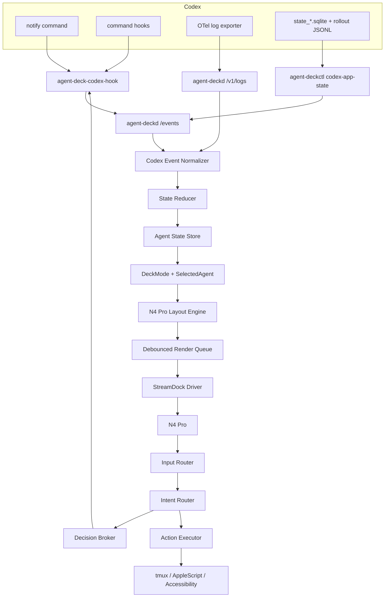

# Agent Deck 第一版设计：macOS + N4 Pro + Codex 最快闭环

状态：草案  
日期：2026-06-12  
范围：第一版可实现设计，不覆盖完整长期路线

## 目标

第一版目标是验证一个完整闭环：

1. Codex 的状态能被本机服务稳定采集。
2. N4 Pro 能实时显示多个 Codex thread/session 的状态。
3. 用户能通过 N4 Pro 选择和聚焦某个 Codex 实例。
4. 对可控的 Codex `PermissionRequest`，用户能通过硬件做允许或拒绝。
5. 系统在硬件断连、服务重启、hook 超时、图像刷新失败时能有明确退化行为。

第一版不追求漂亮完整的桌面 App，而追求可靠状态链路、可测试核心模块和后续扩展边界。

## 非目标

第一版不做：

- Windows 支持。
- Linux 支持。
- 妙联宝 WebSocket transport。
- Claude Code adapter。
- Generic PTY wrapper。
- 完整宠物机制。
- 云端同步。
- 多用户配置。
- 对未知前台窗口盲目输入。
- 绕过 Codex 的权限系统。

## 运行形态

第一版包含三个可执行入口：

1. `agent-deckd`  
   常驻服务。负责接收 Codex 事件、维护状态、渲染 N4 Pro、处理硬件输入和执行动作。

2. `agent-deckctl`  
   命令行控制工具。负责安装检查、配置检查、状态查看、模拟事件、硬件诊断和卸载。

3. `agent-deck-codex-hook`  
   Codex command hook / notify helper。它从 stdin 或 argv 接收 Codex payload，转发到 `agent-deckd`，并在需要时等待 UCB 返回 hook 决策 JSON。

技术栈建议：

- Python 3.11+。
- `uv` 管理 Python 项目、虚拟环境、依赖锁文件和本地命令。
- StreamDock Python SDK。
- Pillow。
- FastAPI 或 aiohttp。
- Pydantic。
- `tomli` / `tomli-w` 或 Python 3.11 `tomllib` 加写入库。
- pytest。

## 进程架构



## 数据入口

### Codex OTel

`agent-deckd` 暴露本地 OTLP HTTP endpoint：

- `POST /v1/logs`

它负责接收 Codex OTel 日志，解析属性并转换成内部 `NormalizedEvent`。

推荐用户级 Codex 配置：

```toml
[otel]
environment = "agent-deck"
exporter = { otlp-http = { endpoint = "http://127.0.0.1:4318/v1/logs", protocol = "binary" } }
log_user_prompt = false
```

说明：

- `log_user_prompt` 默认 false，避免采集敏感 prompt。
- 如果用户希望触屏显示 prompt 摘要，后续可以显式开启或只使用脱敏摘要。
- 端口可配置，默认 4318。

### Codex command hooks

Codex hooks 用于更确定地捕获：

- `SessionStart`
- `PreToolUse`
- `PermissionRequest`
- `PostToolUse`
- `SubagentStart`
- `SubagentStop`
- `Stop`

Codex 当前运行 `type: "command"` handler，所以 hook helper 负责把 stdin JSON 转发给 `agent-deckd`。

推荐 hook 设计：

```json
{
  "hooks": {
    "PermissionRequest": [
      {
        "matcher": "*",
        "hooks": [
          {
            "type": "command",
            "command": "agent-deck-codex-hook permission-request",
            "timeout": 30,
            "statusMessage": "Waiting for Agent Deck decision"
          }
        ]
      }
    ],
    "SessionStart": [
      {
        "matcher": "*",
        "hooks": [
          {
            "type": "command",
            "command": "agent-deck-codex-hook event",
            "timeout": 5
          }
        ]
      }
    ],
    "Stop": [
      {
        "matcher": "*",
        "hooks": [
          {
            "type": "command",
            "command": "agent-deck-codex-hook event",
            "timeout": 5
          }
        ]
      }
    ]
  }
}
```

`agent-deckctl codex-detect --enable-integration` 当前只输出手动接入片段，不自动写入
`~/.codex`。`agent-deckctl codex-install` 默认同样只做 dry-run；只有显式传入
`--apply` 时才会备份并写入配置。安装器支持两种 Codex hook 安装模式：

1. user-level 默认模式
   写入用户级 `~/.codex/config.toml` / `hooks.json`。这种模式不需要管理员权限，
   适合单用户开发环境，但非 managed hooks 需要 Codex 内部 review/trust。

2. managed-system 高级模式
   先运行 `agent-deckctl codex-install --managed-system --validate-only` 做只读验证；
   通过后再用管理员权限运行 `agent-deckctl codex-install --managed-system --apply`
   写入系统 `/etc/codex/requirements.toml` 的 managed hooks。该文件必须包含
   `[hooks].managed_dir` 指向已存在的绝对目录，并安装稳定 wrapper 到
   `/usr/local/lib/agent-deck/codex-hooks/agent-deck-codex-hook`。这种模式需要管理员权限，
   managed hooks 由 Codex policy 信任，不需要 `/hooks` 手动 trust；安装器会清理用户级
   `hooks.json` 中的 Agent Deck entries，避免 user hooks 与 managed hooks 重复上报。

user-level 模式下安装器必须输出后续动作：

- 输出 `merge_dry_run`，只读检查用户级 `config.toml` / `hooks.json` 的存在性和是否已包含
  `agent-deck-codex-hook`。
- 若现有 `notify` 不属于 Agent Deck，提示 `manual_merge_required`，避免覆盖用户已有命令。
- 若 `hooks.json` 缺失，提示创建并使用输出中的 `integration.hooks_json`。
- `codex-install --apply` 遇到 `manual_merge_required` 必须拒绝自动写入，要求用户人工合并。
- `codex-install --managed-system --validate-only` 必须只读检查生成 TOML、系统
  requirements、managed wrapper 和用户级重复 hooks；不得写入 `/etc`、`/usr/local` 或
  `~/.codex`。

- 打开 Codex。
- 运行 `/hooks`。
- 检查 `agent-deck-codex-hook`。
- trust 该 hook。

managed-system 模式不默认开启 `allow_managed_hooks_only`，避免禁用用户自己的 hooks、
项目 hooks 或插件 hooks。它只托管 Agent Deck lifecycle hooks；`notify` 仍作为用户级
turn-complete fallback 保留在 `~/.codex/config.toml`。

### Codex notify

`notify` 用作 fallback 或低成本完成提醒，不作为主状态来源。

推荐配置：

```toml
notify = ["agent-deck-codex-hook", "notify"]
```

### Codex App 本地状态扫描

Codex Desktop App 的 Plan Mode `request_user_input` 不是 `PermissionRequest` hook，也不会
进入当前 command hook 链路。第一版用只读扫描补足这个状态来源：

- `agent-deckctl codex-app-state` 读取 `~/.codex/state_*.sqlite` 的 `threads` 表，再读取
  thread 对应 rollout JSONL。
- 扫描器查找 `payload.type == "function_call"` 且 `payload.name == "request_user_input"` 的
  记录；如果同一 `call_id` 后续没有 `function_call_output`，则认为该 thread 正在等待用户输入。
- 待用户输入映射为 `EventType.INPUT_REQUESTED`，进入 `AgentStateStore` 后显示为
  `waiting_user`，可复用现有 `ASK` / `needs_user` 视觉状态。
- 扫描器还会筛选最近有效 Codex App 会话：未归档、默认最近 1 小时、最多 10 个，并排除
  明显测试标题/路径。筛选出的会话按 rollout 中未完成普通 `function_call` 推断为
  `running_tool`，否则作为近期 `idle` 会话；daemon 用幂等 observed-state upsert 同步这些状态，
  避免重复伪造 `tool.started` 导致工具计数累加。
- `agent-deckctl codex-app-state --sync` 才会把检测出的 `input.requested` 事件 POST 到
  `agent-deckd /events`；默认命令只打印只读报告。

边界：

- 这是 Codex App 私有本地存储的 best-effort 扫描，不是官方稳定接口。
- 扫描器不操作 Codex App UI，不写 SQLite/JSONL，不采集完整 prompt；payload 只携带问题、
  选项标签、call id、rollout path 和行号。
- 如果用户已经选择了选项，rollout 会出现 `function_call_output`，该请求应恢复为
  `observed`，不会继续显示为等待用户。

`agent-deckd` 默认启用 daemon-side Codex App state poller，启动时先同步一次，之后默认
每 5 秒只读扫描一次。命令行可通过 `--disable-codex-app-state-poller` 关闭，或通过
`--codex-app-state-poll-interval-seconds` 调整间隔；最近有效会话可通过
`--codex-app-state-scan-limit`、`--codex-app-active-window-seconds` 和
`--codex-app-active-session-limit` 调整。

### Codex quota 轮询与底部虚拟视窗

Codex quota 来自短生命周期 `codex -s read-only -a untrusted app-server` 的
`account/rateLimits/read`。第一版不把 quota 作为 agent 状态事件，而是作为 daemon runtime
中的独立快照：

- `agent-deckd` 默认启用 quota poller，启动时先读取一次，之后默认每 300 秒刷新一次。
- 每次成功读取后，runtime 保存 `CodexQuotaSnapshot`，并用 `render_quota_touchscreen` 渲染
  N4 Pro 的 800x480 触屏背景图；内容只落在底部 `N4PRO_TOUCH_BAR_VIEWPORT`。
- daemon 默认把这张图下发到 `--streamdock-quota-device n4pro` 对应的真实硬件触屏；没有触屏能力
  或不希望接管硬件时，可用 `--disable-streamdock-quota-touchscreen` 关闭。
- 当启用 `--enable-streamdock-n4pro-renderer` 时，daemon 使用统一 N4 Pro renderer 在同一次
  设备会话里写 quota 背景和 Codex 状态按钮动画；此时 quota-only 真实触屏 sink 自动关闭，
  避免两条硬件写入路径互相 `init()` 清屏。
- `/status` 暴露最新 quota snapshot、更新时间、最近错误、触屏图渲染计数和真实
  StreamDock 下发结果；统一 renderer 还会暴露最近一次背景+按钮下发结果，便于判断是
  quota 读取失败、图片渲染失败、帧目录缺失还是设备被占用。
- quota 渲染层展示剩余百分比，即 `100 - used_percent`；adapter 仍保留 app-server
  返回的原始 `used_percent` 语义。

命令行可用 `--disable-codex-quota-poller` 关闭 quota 刷新，用
`--codex-quota-poll-interval-seconds` 调整刷新间隔，用 `--codex-quota-timeout-seconds`
控制单次 app-server 读取超时。`--streamdock-quota-device` 当前默认 `n4pro`，未来扩展到没有
触屏或触屏尺寸不同的设备时，应通过设备能力 profile 决定是否显示 quota panel 以及使用哪种
renderer。

由于 `notify` 和 `otel` 不能由项目级 `.codex/config.toml` 设置，安装器只能改用户级 `~/.codex/config.toml`，并必须先备份。

## 内部数据模型

### NormalizedEvent

建议字段：

```text
event_id
source
source_event_type
normalized_type
agent_id
session_id
thread_id
turn_id
cwd
title
tool_name
severity
summary
payload
occurred_at
received_at
```

约束：

- `payload` 保留原始事件的必要子集，不保留敏感全量内容。
- 对用户 prompt、命令参数、环境变量做脱敏。
- `event_id` 用 source + event timestamp + stable identifiers 生成，避免重复事件造成闪烁。

### AgentState

建议字段：

```text
agent_key
source
display_name
cwd
status
status_since
last_event_at
last_summary
active_tool
pending_decisions
subagents
slot_id
focus_target
muted
```

`status` 取值：

- `offline`
- `idle`
- `thinking`
- `running_tool`
- `waiting_user`
- `approval_needed`
- `error`
- `completed_recently`

### PendingDecision

建议字段：

```text
decision_id
agent_key
session_id
turn_id
tool_name
reason
allowed_behaviors
created_at
expires_at
default_behavior
status
result
```

约束：

- `default_behavior` 第一版固定为 `deny`。
- 每个 pending decision 有自己的 async future/event，不使用全局阻塞锁。
- 到期后必须 cleanup UI 和 action binding。

## 官方场景与内部 DeckMode

妙联宝官方软件的“场景配置”适合作为用户入口，但第一版不依赖它作为动态状态展示底座。

第一版建议用户手动创建一个官方 `Agent Deck` 场景，用于放置静态入口：

- 启动或停止 `agent-deckd`。
- 打开 Agent Deck 本地管理页。
- 打开日志目录。
- 打开配置目录。
- 回到用户自己的默认 Stream Dock 场景。

真正的动态展示和交互由 Agent Deck 内部 DeckMode 控制。DeckMode 是 daemon 内的运行模式，不等同于官方场景配置。

第一版 DeckMode：

- `overview`：总览所有 Agent/session slots。
- `agent_detail`：当前选中 Agent 的详情和最近事件。
- `decision`：当前 pending decision 的审批或选择界面。
- `quick_prompt`：快捷 prompt 模板选择界面，默认功能关闭。
- `settings`：亮度、显示模式、静音等本地控制。

渲染链路：

```text
AgentState + PendingDecision + SelectedAgent + DeckMode
  -> LayoutPlan
  -> N4ProRenderer
```

而不是由 `AgentState` 直接生成 N4 Pro 画面。这样后续接入其他硬件、官方插件模式或宠物机制时，不需要改状态归约层。

如果官方 Stream Dock 软件和 Python HID 直连不能同时控制设备，第一版采用 **Agent Deck 独占控制模式**：启动 `agent-deckd` 后由 Agent Deck 接管设备，退出后释放设备，让用户回到官方软件场景。

## N4 Pro 布局

第一版使用逻辑区域，不依赖硬件物理编号含义。下面是各 DeckMode 的初始投影方式。

### overview

默认模式。展示所有 Agent/session slots 和少量全局动作。

按键区：

- `keys 1-10`：Agent/session slots。
- `keys 11-14`：上下文动作区。
- `key 15`：全局模式/返回/当前详情。

触屏：

- 显示当前选中 Agent 的概要。
- 显示所有 pending decision 的数量。
- 显示 daemon/硬件连接状态。

旋钮：

- 旋钮 1：切换选中 Agent。
- 旋钮 2：滚动当前 Agent 最近事件。
- 旋钮 3：选择快捷 prompt 模板。
- 旋钮 4：亮度或显示模式。

### agent_detail

当前选中 Agent 的详情模式。

触屏显示：

- Agent 名称。
- 当前 cwd 简写。
- 当前状态。
- 最近事件摘要。
- 当前工具名。
- pending decision 内容摘要。

按键区：

- 保留 Agent slots，方便快速切换。
- 上下文动作区显示 focus、mute、quick prompt、back。

### decision

有 pending decision 时进入或临时覆盖。该模式优先级高于 `overview` 和 `agent_detail`。

按键区：

- 上下文动作区显示 allow、deny、details、back。
- slot 上显示 pending 数量角标。

触屏：

- 显示当前 decision 摘要。
- 显示工具名、来源 Agent、超时倒计时。
- 不显示 raw tool input，除非用户开启 debug。

### quick_prompt

快捷 prompt 模板模式。第一版默认关闭自动输入，只允许复制到剪贴板并聚焦目标。

### settings

本地设置模式。第一版只覆盖亮度、显示模式、清屏/恢复。

### 共用按键表现

slot 键显示：

- 项目简称或 thread 标题。
- 状态色块。
- 简短状态文本，例如 `RUN`、`WAIT`、`ASK`、`ERR`、`DONE`。
- pending 数量角标。

动作键显示：

- 当前没有 pending decision 时：快捷动作，例如 focus、mute、next、quick prompt。
- 有 pending decision 时：临时覆盖为 allow、deny、details、timeout countdown。

触摸屏输入第一版只做：

- 点击区域切换 tab 或 details。
- 不做复杂表单输入。

旋钮按压：

- 旋钮 1 按压：聚焦当前 Agent。
- 旋钮 2 按压：打开详情。
- 旋钮 3 按压：发送当前快捷 prompt，需显式配置开启。
- 旋钮 4 按压：切换暗色/亮色或清屏恢复。

### LED

LED 显示全局聚合状态：

- 蓝色：至少一个 Agent 正在工作。
- 黄色：至少一个 Agent 等待用户。
- 红色：至少一个 Agent 错误或有 deny/default-timeout。
- 绿色：全部 idle。
- 熄灭或低亮：没有在线 Agent。

## 状态归约规则

初始规则：

- `SessionStart` -> `idle`
- `UserPromptSubmit` -> `thinking`
- `PreToolUse` / OTel tool start -> `running_tool`
- `PostToolUse` -> 若没有其他 active tool，回到 `thinking` 或 `idle`
- `PermissionRequest` -> `approval_needed`
- `Stop` / turn complete -> `completed_recently`，短暂展示后回到 `idle`
- `PostToolUseFailure` / response failed -> `error`
- 超过 idle ttl 无事件 -> `offline`

状态归约必须基于事件序列和时间窗口，不能只看最后一条事件。

## 决策 broker

`PermissionRequest` 流程：

1. Codex 执行 command hook，hook helper 从 stdin 读入 JSON。
2. hook helper 调用 `agent-deckd /decisions/request`。
3. `agent-deckd` 创建 `PendingDecision`，更新 state store。
4. renderer 将 N4 Pro 上下文动作区切换为决策界面。
5. 用户按 allow/deny，硬件 input 转成 `approve_request` 或 `deny_request` intent。
6. decision broker 设置结果。
7. hook helper 收到结果，向 Codex stdout 输出对应 JSON。
8. renderer 清理临时动作区，slot 恢复正常状态。

Codex allow 返回：

```json
{
  "hookSpecificOutput": {
    "hookEventName": "PermissionRequest",
    "decision": {
      "behavior": "allow"
    }
  }
}
```

Codex deny 返回：

```json
{
  "hookSpecificOutput": {
    "hookEventName": "PermissionRequest",
    "decision": {
      "behavior": "deny",
      "message": "Denied by Agent Deck."
    }
  }
}
```

约束：

- 超时默认 deny。
- 服务不可达时，approval hook 默认 deny；普通事件 hook 默认 no-op。后续可以提供显式配置项允许用户改成 fall-through。
- 多个 pending decision 同时存在时，只高亮当前选中 Agent 的决策，同时用角标提示其他 pending。
- 不允许一个硬件输入同时 resolve 多个 decision。

## 动作执行

第一版支持以下 action：

### focus_agent

按优先级尝试：

1. 如果配置了 tmux target，执行 `tmux select-window` 或 `tmux select-pane`。
2. 如果配置了 terminal app，执行 AppleScript 激活 Terminal/iTerm/Warp。
3. 如果配置了 Codex App bundle id，激活 Codex App。

所有命令执行时注入防递归环境变量，例如：

```text
AGENT_DECK_INTERNAL=1
```

### send_quick_prompt

默认关闭。开启后必须满足：

- 当前 Agent 有明确 focus target。
- 用户先执行 focus，或配置允许直接发送。
- 输入内容来自配置模板，不包含动态敏感内容。

第一版可以先只实现“复制到剪贴板并聚焦”，不自动按 Return。

### approve_request / deny_request

只作用于 `PendingDecision`。不直接向终端输入字符。

## 配置与文件位置

建议：

- 用户配置：`~/Library/Application Support/AgentDeck/config.toml`
- 运行状态：`~/Library/Application Support/AgentDeck/state.sqlite`
- 图像缓存：`~/Library/Caches/AgentDeck/images`
- 日志：`~/Library/Logs/AgentDeck/agent-deckd.log`
- Codex 配置备份：与 `~/.codex/config.toml` 同目录，带时间戳后缀。

示例配置：

```toml
[server]
host = "127.0.0.1"
event_port = 8765
otlp_port = 4318

[hardware]
driver = "streamdock-python"
preferred_model = "N4Pro"
brightness = 80

[codex]
enable_otel = true
enable_hooks = true
enable_notify = true
permission_timeout_seconds = 30
permission_timeout_behavior = "deny"

[actions.focus]
enabled = true
default_terminal_app = "Terminal"

[actions.quick_prompt]
enabled = false
```

## 渲染策略

要求：

- 不在每个事件上全量刷新设备。
- 对状态变化做 debounce，例如 100-250ms。
- 使用 image hash 缓存，避免重复生成相同图像。
- 将设备写入放在单独 worker，避免阻塞 HTTP/event handling。
- 渲染失败时保留上一次可用图像，并记录日志。
- 设备断连时暂停渲染队列，重连后执行 full redraw。

第一版可以仍使用 SDK 的 path-based image API，但必须把临时文件放在 cache 目录，并按 hash 复用。

## 错误处理

### `agent-deckd` 不可达

- 普通 event helper：静默失败或写 stderr，不影响 Codex。
- PermissionRequest helper：默认 deny，更安全。后续可以提供显式配置项允许用户改成 fall-through。

### 硬件断连

- 状态 store 继续运行。
- 渲染队列暂停。
- hook 决策不能依赖硬件时，超时默认 deny。
- 重连后重新 init、清屏、full redraw。

### Codex 配置冲突

- 安装前备份。
- 不覆盖用户已有 `notify` 或 `[otel]`，而是检测、提示合并策略。
- 如果无法安全合并，`agent-deckctl install codex --dry-run` 输出手动 patch。

### 官方软件和 HID 直连冲突

- 如果 Stream Dock 官方软件占用设备导致 Python SDK 打不开设备，`doctor` 应提示用户退出官方软件或切换到 Agent Deck 独占控制模式。
- 第一版不自动创建或切换官方场景。
- 第一版文档可以指导用户手动创建 `Agent Deck` 官方场景作为启动入口。

### 敏感信息

- 日志默认不记录完整 prompt、完整 shell command、环境变量。
- 对 token、key、secret、authorization 等字段做脱敏。
- 触屏不显示 raw tool input，除非用户开启 debug。

## 测试策略

### 自动化测试

- normalizer：Codex OTel JSON/protobuf 样例、hook JSON 样例、notify 样例。
- reducer：事件序列到状态的表驱动测试。
- decision broker：allow、deny、timeout、服务关闭、多 pending。
- renderer：给定状态生成 layout plan，不连接真实硬件。
- fake hardware：模拟按键、旋钮、触屏输入。
- config installer：对临时 `config.toml` 做 dry-run merge。

### 手动验证

1. `agent-deckctl doctor` 能检测 Python、SDK、N4 Pro、Codex 配置。
2. `agent-deckctl codex-detect --enable-integration` 能输出 Codex hooks/notify 手动接入片段。
3. `agent-deckctl codex-install` 默认 dry-run，不写 Codex 配置。
4. `agent-deckctl codex-install --apply` 在无冲突时备份并写入 Codex 用户级配置。
5. `agent-deckctl simulate codex-session` 能在无 Codex 时点亮 slot。
6. 启动 Codex 后，N4 Pro slot 能显示 session 状态。
7. Codex 执行需要 approval 的操作时，N4 Pro 出现 allow/deny。
8. 按 deny 后 Codex 不执行操作。
9. 按 allow 后 Codex 继续操作。
10. 拔掉 N4 Pro 后服务不崩溃。
11. 重插 N4 Pro 后屏幕恢复。
12. 关闭 `agent-deckd` 后 PermissionRequest helper 按配置 fail-closed。

## 第一版交付物

- `uv` 项目配置和锁文件。
- Python package skeleton。
- `agent-deckd` 常驻服务。
- `agent-deckctl doctor/install/status/simulate/codex-detect`。
- `agent-deck-codex-hook`。
- Codex OTel receiver。
- Codex hook/notify helper。
- N4 Pro driver adapter。
- N4 Pro layout renderer。
- fake hardware adapter。
- 测试样例和文档。

## 开放问题

1. 第一版是否默认修改 `~/.codex/config.toml`，还是只提供 dry-run patch？
2. 是否允许用户把 PermissionRequest helper 的服务不可达策略从默认 deny 改成 fall-through？
3. 你的 Codex 主要运行形态是 Codex Desktop App、CLI、IDE extension，还是混合？
4. 聚焦动作优先支持 Terminal、iTerm2、Warp、Codex App 中的哪一个？
5. 快捷 prompt 第一版是否开启，还是只做复制到剪贴板？
6. 官方 Stream Dock 软件和 Python HID 直连是否能在你的 N4 Pro 上同时运行，需要实测。
7. 是否把官方 `Agent Deck` 场景的创建步骤写成手动教程，还是后续研究自动导入场景配置。

这些问题不阻塞基础架构设计，但会影响第一版实现的默认行为。
